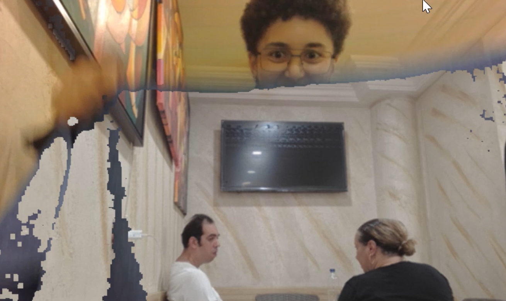

# Harry Potter Invisibility Cloak (and other effects)

[](https://www.python.org/)
[](https://opencv.org/)
[](https://numpy.org/)
[](LICENSE)

This is a **real-time invisibility cloak** using Python and OpenCV. This project makes a cloak “disappear” on webcam feed using color detection, background subtraction, and image masking.  
You can also have fun effects like cartoonifying or adding a glowing aura to the cloak.  

---

## Controls

| Key | Effect                     |
|-----|----------------------------|
| 0   | Invisible Cloak            |
| 1   | Cartoon Cloak              |
| 2   | Glowing Cloak              |
| c   | Quit                       |

---
## Demo



---

## Installation

1. Install dependecies
```bash
pip install opencv-python numpy
```


2. Clone the repository
```bash
git clone https://github.com/ELahiani/HarryPotterCloak.git
cd HarryPotterCloak 
```

3. Run the program
```bash
python invisibility_cloak.py
```

---
Made with ❤️ by Eya Lahiani
